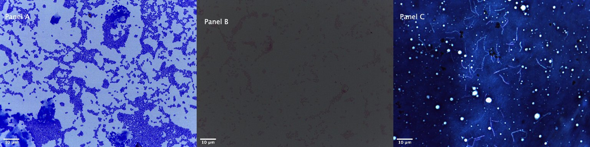
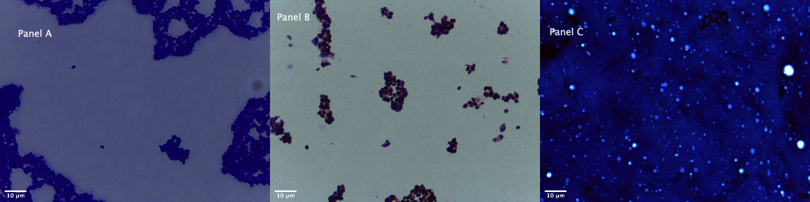
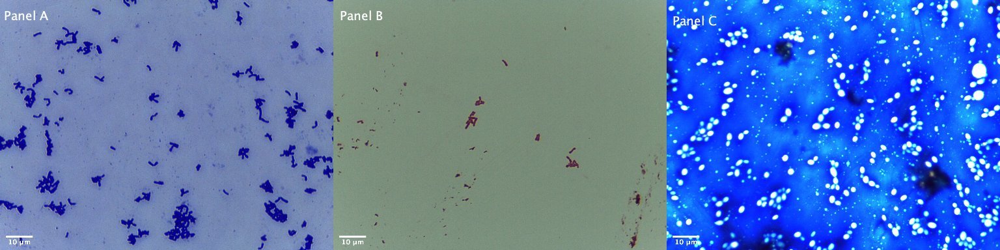
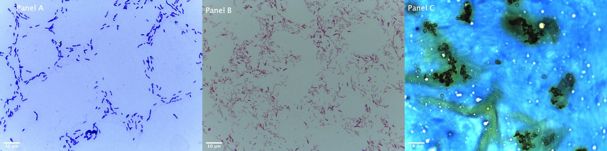
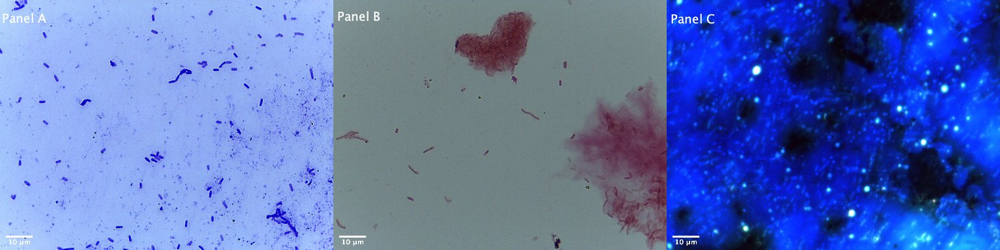
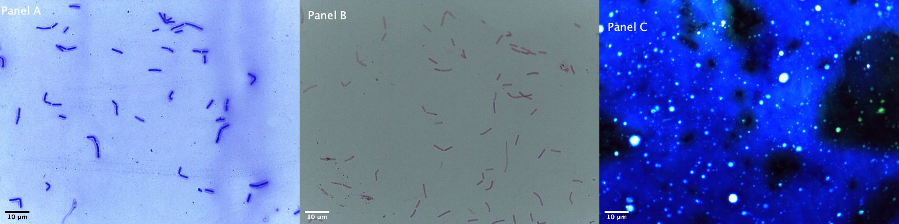
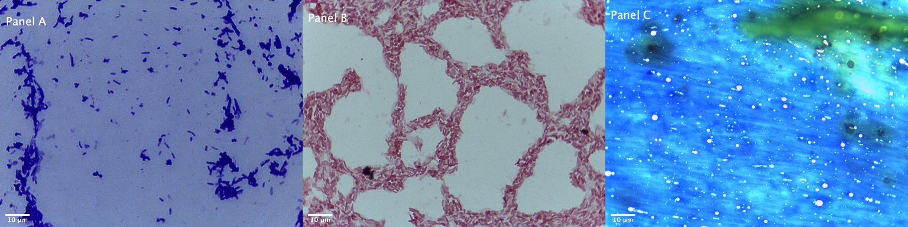
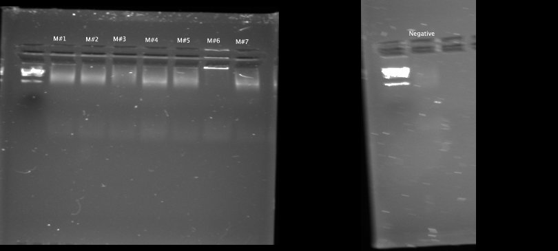
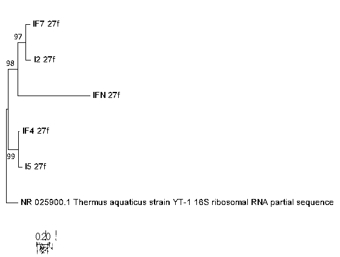
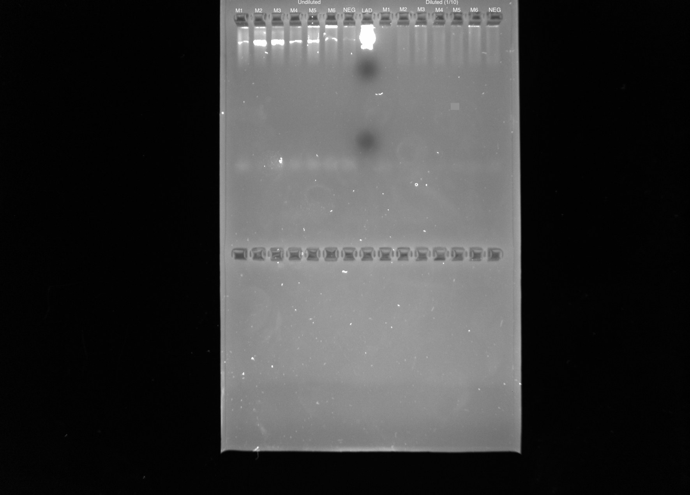

```{r setup, include = FALSE}
knitr::opts_chunk$set(echo = FALSE, message = FALSE, warning = FALSE)
```

# Introduction
Classifying plants as standalone entities is inaccurate because they host a diverse array of microorganisms that are essential to their major functions [@nihorimbere2011beneficial]. Although microbes are fundamental to plant maintenance, little is known about the exact microbial communities inhabiting different plants species around the world and their impact on plants’ ecological function. In addition, the leaf microbiome, or phyllosphere microbiome, is influenced by abiotic and biotic factors that make this dynamic relationship harder to understand [@copeland2015seasonal]. Leaves are a huge contributor to a plant’s system and it is estimated that about 6.4 × 108 km2  microbes can colonize a leaf’s surface area [@morris2002fifty]. Culture-based and molecular techniques have helped biologists examine isolated microbes in greater detail. These techniques can be applied to examining the phyllosphere and its vast array of microbial communities. Thus far, many different genera of bacteria, fungi, yeasts, and algae have been identified through research [@andrews2000ecology]. Most of the microorganisms which inhabit the phyllosphere are bacteria [@delmotte2009community]. Of the bacteria identified in various communities, *Pseudomonas*, *Acinetobacter*, and *Bacillus* were found to be among some of the most abundant genera found across various plant species [@redford2009bacterial]. The reasoning as to why these genera predominant the phyllosphere may be linked to the environments in which many plant species are found. The leaf surface is exposed to a rapidly fluctuating environment due to changing temperatures such as rain and humidity and physiochemical interactions [@jumpponen2009massively]. These short-scaled fluctuations may select for bacterial species with versatile traits that allows them to better adapt and colonize plant surfaces over other genera. 

The focus on my investigation was to examine differences in the colonies and morphotypes present on two plants growing on the Lone Mountain portion of the University of San Francisco’s Hilltop Campus. The two plants I examined were the ice plant (*Carpobrotus edulis*) and the fern-leaf yarrow (*Achillea filipendulina*). I chose these particular plants because of their differing plant structure and environmental status. Fern-leaf yarrows are bright, yellow flowering plants and ice-plant is a succulent with a very low percentage of flowers present. Plant-pollinator relationships are highly important to plant biodiversity and in particular, about 90% of all flowering plants rely on animals for pollination [@ollerton2011many]. In Northern California, fern-leaf yarrows are naturalized plants and ice plant is considered an invasive species. Plant invasions are known to pose serious threats to native and naturalized plant communities by robbing natural resources and reducing overall biodiversity [@foxcroft2013bottom]. Due to the structural diversity and environmental impact between these plant species types, I hypothesized that there would be a greater morphotype diversity and higher colony counts present on the leaves of fern-leaf yarrows because of the higher interactions with pollinating insects and its proximity to an invasive plant species requires more microbes to protect and enhance its fitness against the invasive threat. 

To test this plant-microbiome relationship, I conducted culture-based techniques from samples obtained on the leaves of each plant species. I grew cultures on tryptic soy agar (TSA) plates at three different dilutions. I found both colony and morphotype counts to be larger in fern-leaf yarrow leaves but there was only a statistical significance between the morphotype counts of each plant. I obtained pure cultures for 7 different observed morphotypes. I created a crystal violet stain, gram stain, and Maneval’s stain slides for each morphotype under a light microscope. After collecting images for stain, I measured the length, width, and area for each microbe using the ImageJ software and Fiji platform. I also analyzed the mean and standard deviation for the length, width, and area of each microbe. My predictions for each morphotypes identities yielded a high concentration *Bacillus* species and *Pseudomonas* species. I performed PCR amplification and Sanger sequencing to obtain successful BLAST results. The advantages to using the Sanger sequencing method is that it’s been the most widely used sequencing method for the past 40 years, it works well for small-scaled projects, and is the easiest method to resolve uncertainties in data [@hagemann2015overview]. Of the 7 morphotypes I investigated, I received successful matches for 4 of them. The identities of the morphotypes belong to either *Bacillus* or *Pseudomonas* genera. A maximum likelihood phylogeny with bootstrap support further supported their identities and relationships to one another. 

# Methods

## Study design

### Field Collection
On January 31st, 2019, I sampled leaves from a fern-leaf yarrow and an ice plant located at the Lone Mountain campus of the University of San Francisco in San Francisco, California (37.776$^\circ$N, 122.4506$^\circ$W). For each plant, I collected samples from 3 different leaves which were located at 3 different elevations from the soil to the tip of the plant. I used a new, sterile cotton swab on each leaf for approximately 10 seconds and then I proceeded to place each swab into a labeled tube filled with 1mL of PBS solution. To obtain the control for my experiment, I used sterile swabs to collect 3 air samples from the area where the plants were located. I exposed each swab to the air for approximately 10 seconds and placed each swab into a labeled tube filled with 1mL of PBS solution. I kept each sample swab in its respective tube for approximately an hour and a half before removing it for culturing. 

### Culturing and Dilution Plating 
I used 100mm tryptic soy agar (TSA) plates for plating the three sample treatments I collected. I first vortexed each test tube for approximately 10 seconds in order to release remaining microbes from the cotton swab and into the PBS solution. For each tube, I transferred 50 µL into a new sterile tube and added 450 µL of PBS solution to create a 10x dilution sample. I created a 100x dilution sample by transferring 50 µL from the 10x dilution and adding 450 µL of PBS solution. For each sample collected at each plant type and control, I used 27 TSA plates. Each TSA plate was covered with its respective PBS and sample solution mix at a concentration of either 1, 10, or 100. I spread the bacterial liquid onto each TSA plate by swirling approximately 6-8 glass beads until the plate was completely covered. The glass beads were removed and appropriately disposed of. I placed these plates inside an incubator at 37$^\circ$C for a weak to allow colonies to grow. On February 5, 2019, I removed all of the plates from the incubator in order to examine colonial morphology and counts. I distinguished morphotypes based on color, pigmentation, shape, colony margin, and elevation. Any additional features or anomalies such as distinctively emitted smells were noted as well. To count the number of colonies per plate, I used a Sharpie pen to mark each counted colony as to avoid miscounting.

### Streak Plating
For further examination, I obtained pure microbial cultures from morphotypes that I observed to be either in high abundance or very rarely present among all of the TSA dilution plates from my samples. To do this, I used an inoculating loop to scoop the desired morphotype colony from the diluted plate. I transferred the single colony on a sterile TSA plate by streaking the loop across one third the agar surface, inoculating the loop with a bacticinerator, dragging the loop through the 1st streak and streaking another third, and repeating once more. This method should isolate pure cultures of microbes. I completed this method 7 times, once for each morphotype observed. I also used the bacticinerator to sterilize the metal loop between each morphotype streaking. After 5 days of incubating the plates at 37$^\circ$C, I restreaked plates that did not produce single colonies or were contaminated. The restreaked plates were incubated for only two days.

### Staining and Microscopy
In order to visualize and identify the different morphotypes, I created 3 stained slides from the pure cultures I obtained. I made a crystal violet stain, gram stain, and Maneval’s stain. These staining methods were used so that I could observe and identity microbes’ different physical features under a light microscope. Crystal violet staining helps to visualize the basic size, shape, and arrangement of the cells. Gram staining helps distinguish between gram-positive and gram-negative bacteria. Maneval’s stain is a negative stain that shows whether the bacterium contains a capsule.  After mounting, fixing, and staining each culture, I placed the slide under a Leica DM500 light microscope and observed each slide at 1000x magnification under immersion oil. 

### DNA Extraction, PCR Amplification and Gel Electrophoresis
I followed the standard DNA extraction protocol for bacterial cells as provided in the SigmaREDExtract n’ Amp Plant Kit. For the PCR amplification, the PCR recipe per reaction mixture is as follows: 4µL template DNA, 10µL Amp solution, 1µL of 10µM 27f primer, 1µL 10µM 1492r primer, 1µL 1M BSA, and 3µL PCR water. The temperature and run time for each PCR cycle are as follows: 3min at 94$^\circ$C, 30 seconds at 94$^\circ$C (35 times), 30 seconds at 55$^\circ$C (35 times), 2 minutes at 72$^\circ$C (35 times), 10 minutes at 72$^\circ$C, and holding at 4$^\circ$C. I checked for successful PCR amplification using 1% agarose gel. The gel was run for 30 min at 100V. Products were visualized with SYBR Safe and UV light. The ladder in image is a 1kb ladder (Bio-Rad Laboratories, Inc). After checking for successful amplification using gel electrophoresis, PCR products were cleaned with Invitrogen ExoSAP. They were sent for unidirectional Sanger sequencing at MCLAB located in South San Francisco, CA. 

### Second Round of PCR Amplification
I performed a second round of PCR amplification with a 1/10 master mix dilution for unsuccessful BLAST sequences with sufficient Qubit DNA concentrations. For the new PCR amplification, the PCR recipe per reaction mixture is as follows: 1µL template DNA, 10µL Amp solution, 0.5µL of 10µM 27f primer, 0.5µL 10µM 1492r primer, 1µL 1M BSA, and 7µL PCR water. For unsuccessful BLAST sequences with very low Qubit DNA concentrations, I performed a second PCR amplification with the 1/10 master mix dilution and reextracted DNA. The annealing temperature was modified to be 1 degree higher (56 $^\circ$C) and I ran the PCR cycles 32 times instead of the original 35 times. 

## Computational Analysis

### Culturing Analysis
The process to analyze the data gathered was accomplished using a systematic workflow. First, I created and uploaded data onto a Google Sheet. I added data about the number of different colonies and morphotypes counted per TSA plate at each concentration for each sample treatment. This sheet was then converted and exported as a csv file to the raw data project file folder. Using the R language and RStudio, I uploaded my project and added various software packages such as dplyr and ggplot2 to a Rmd file. I used the csv data file and appropriate packages I added to create the figures for my analysis. I also performed ANOVA analyses on both colony and morphology counts.  

### Microscopy Analysis
I connected the light microscope to a computer containing the Leica LAS E2 software in order to directly take photos of each slide from the microscope. Photos were standardized and captured at 2048x1536 resolution. After obtaining my images, I used Fiji and ImageJ to measure and analyze each image. Fiji is an image processing package within the ImageJ software that focuses on biological-image processing [@schindelin2012fiji]. I uploaded the captured micrograph and then proceeded to calibrate and scale each micrograph to 10 m. I changed each image to an inverted, binary form and recorded the length, width, and area for 5 cells per morphotype. I created a montage with appropriate labels of each micrograph taken for each staining method per morphotype. Using R and R studio, I uploaded these montages to my report with appropriate captions. I also analyzed the mean and standard deviation for length, width, and cell surface area per morphotype. Finally, I created a markdown table displaying the appropriate characteristics I observed to be present per morphotype.  

### Molecular Analysis
I analyzed the sequence data using the program MEGA7. The Molecular Evolutionary Genetic Analysis (MEGA) software is an integrated desktop tool designed to preform sequence alignments, infer phylogenetic trees, mine web-based databases, estimate rates of molecular evolution, and test evolutionary hypotheses [@kumar2008mega]. Using MEGA7, I manually trimmed raw Sanger sequences as well as noted which sequences failed. I exported the trimmed sequences to Fasta. Using the ClustalW program, I aligned the trimmed sequences along with the sequence for the outgroup, *Thermus aquaticus*. Using the saved alignment, I used the Maximum Likelihood method to infer their phylogeny. Using NCBI Blast and the GenBank nucleotide database, I searched for the identities and accompanying descriptions for each non-failed, trimmed sequence.   

### Phylogenic Analysis by Maximum Likelihood Method
The evolutionary history was inferred by using the Maximum Likelihood method based on the General Time Reversible model [@nei2000molecular]. The tree with the highest log likelihood (-1393.40) is shown. The percentage of trees in which the associated taxa clustered together is shown next to the branches. Initial tree(s) for the heuristic search were obtained automatically by applying Neighbor-Join and BioNJ algorithms to a matrix of pairwise distances estimated using the Maximum Composite Likelihood (MCL) approach, and then selecting the topology with superior log likelihood value. A discrete Gamma distribution was used to model evolutionary rate differences among sites (5 categories (+G, parameter = 200.0000)). The rate variation model allowed for some sites to be evolutionarily invariable ([+I], 0.00% sites). The tree is drawn to scale, with branch lengths measured in the number of substitutions per site. The analysis involved 6 nucleotide sequences. Codon positions included were 1st+2nd+3rd+Noncoding. All positions containing gaps and missing data were eliminated. There were a total of 250 positions in the final dataset. Evolutionary analyses were conducted in MEGA7 [@kumar2016mega7].

# Results

## Colony Counts
The first thing I investigated was the number of colonies present for each sample treatment at the original concentration (1x). Looking at each sample, I observed that, qualitatively, the number of colonies found on the leaves of fern-leaf yarrow plants is larger than the number of colonies found on the leaves of ice plants but I found no statistical significance (Figure 1; ANOVA, p = 0. 3372). 

## Detecting Morphotypes
Because of the differences I observed in colony counts, I decided to investigate whether the sample treatments differed in the number of morphotypes I detected per sample. The average number of morphotypes detected in fern-leaf yarrow plants were larger than the average number found in ice plants (Figure 2; ANOVA, p = 0.03303). One of the morphotypes I detected at the highest frequencies were white, circular, glistening, and raised. One of the rarest morphotypes obtained from the 1x sampling plates was present in the fern-leaf yarrow sample which was taken from the leaf closest to the soil of the plant.

# Discussion

## Culturing
The focus of my investigation was to determine whether differences in the colonies and morphotypes present on a fern-leaf yarrow plant and ice plant growing on the Lone Mountain portion of the University of San Francisco’s Hilltop Campus. I hypothesized that the fern-leaf yarrow plant would have higher colony counts and morphotype diversity than the ice plant. The result of this experiment suggests that the plant structure and naturalized status allow fern-leaf yarrows to have greater morphology diversity. Although, qualitatively, fern-leaf yarrows exhibited higher colony counts, there was no statistical difference between the mean counts of the two plants. Some limitations and caveats of the study that are important to mention are the weather on my day of collection and the type of media I used for culturing. There were rain showers the night and morning before I collected my samples which could have potentially added or removed microbes and reduced the amount pollinator visits to each plant type. In addition, I used TSA plates to grow the microbes which may have negatively impacted the morphotypes I observed. My observations may be based on only a subset of microorganisms because tryptic soy agar is an ideal media for bacterial growth, not fungi or plant microbes that are very common in plant species. 

Differences in performance among plant species can greatly impact ecosystem function so studying the plant microbiome is important. Invasive plant species, like ice plants, are often able to invade and persist in their environment due to their ability in altering soil chemistry and nutrient cycling through the microbes that accompany them [@vila2011ecological]. This can lead to the decline in species diversity among native and naturalized plants in their respective environment. To try and combat this depletion in resources, native and naturalized plants such as the fern-leaf yarrow may recruit more beneficial microbes that can aid in tolerance or defense from varying environmental stresses. In addition, scientists argue that invasive plants can be released from attack by natural enemies, like fungal and viral pathogens [@mitchell2003release]. This may have contributed to the differences I observed in the number of morphotypes present on each plant species. Understanding the microbial impact of invasive species on native and naturalized plants and their ecosystem can be an effective tool in restoring habitats that have been negatively impacted by introduction these invasive plants.

## Predicting Species based on Microscopy
The purpose of performing this microscopy analysis was to gain more detailed information about some of the microbial communities present on the leaves of ice plants (*C. edulis*) and fern-leaf yarrows (*A. filipendulina*). The predictions I made for my selected morphotypes based on the staining results are as follows: morphotype #1 is *Azomonas agilis*, morphotype #2 is *Staphylococcus aureus*, morphotype #3 is an *Acidovorax* spp., morphotype #4 is *Pseudomonas aeruginosa*, morphotype #5 is a *Pseudomonas* spp., morphotype #6 is *Bacillus subtilis*, and morphotype #7 is a *Bacilius* spp. (Table 2). The majority of the morphotypes were gram negative, bacillus shaped bacterium. From all of microbes I analyzed, only the $2^{nd}$ and $3^{rd}$ morphotypes were gram positive. In addition, the only cocci shaped bacteria I noted were morphotypes #1 and #2 (Fig.3, Fig.4). Almost of the predictions I made for the identities of the morphotypes fall under two genera, *Bacillus* and *Pseudomonas*. Both of these genera are found globally, in both plants and mammals. Both genera contain species that can benefit and protect or cause infection to the host. For example, *Pseudomonas aeruginosa* is a naturally occurring bacterium that causes infections in immunocompromised humans acts as a pathogen in plants. In plants, *P. aeruginosa* is an opportunistic pathogen in that it exploits a break in the host defenses to initiate an infection [@todar2012]. Pathogens are harmful in that infections can eventually lead to disease or death in the host.

## Combining Microscopy and Molecular Data
The phyllosphere presents an opportunity to observe the diverse interactions between plants and bacterial communities. Although the phyllosphere supports great microbial diversity, there is still limited information about the exact microbes that inhabit various plant species. Of the sequences which successfully resulted in valid BLAST results, the two most abundant genera present were *Bacillus* and *Pseudomonas*. *Bacillus* is characterized as being rod-shaped, endospore-forming, and gram-positive. Although it is characterized as being gram-positive, some cultures can eventually turn gram-negative with age [@turnbull1996]. 

The two morphotypes I identified as Bacillus species are morphotype #2 and morphotype #7 (Table 4). The microscopy images obtained contained some anomalies as when compared to its defining characteristics. I categorized morphotype #2 as being gram-positive and cocci-shaped and morphotype #7 as being bacillus and gram-negative. Some *Bacillus* species can be classified as coccobacillus-shaped. In addition, the body sizes of *Bacillus* spp. often range between 0.5-1.0 µm wide by 1.0-4.0 µm long [@turnbull1996]. This accounts for why I initially classified the morphotype as cocci-shaped. Although morphotype #7 does clearly exhibit the bacillus shape, it stained gram-negative. This could be explained by either human error or age. In my process of staining, I possibly may have destained the crystal violet completely off of the slide which would have caused the safranin to completely stain the cells, giving the appearance of a gram-negative bacteria. Another possibility is that although *Bacillus* is characterized as being gram-positive, some cultures can eventually turn gram-negative with age [@turnbull1996]. A 97% bootstrap support provides further evidence of the morphtypes likely belonging to the same genera (Fig. 11). Bacillus spp. are among some of the most globally dispersed bacteria and produce many biological compounds that affect host plants and their interactions with other organisms. For example, *Bacillus substilis* is isolated to produce the biocontrol product Serenade which effective in controlling foliar and soilborne pathways from pathogenic bacteria such as *Pseudomonas* [@bais2004biocontrol]. 

Morphotypes #4 and #5 were identified as having a *Pseudomonas* origin (Table 4). *Pseudomonas* species, under a light microscope, appear as gram-negative and straight or slightly curved rods with sizes ranging from 0.5-1.0 µm wide to 1.5-5.0 µm long [@kumar2011extracellular]. The generalized features of *Pseudomonas* match those that I observed from microscopy as well as predicted in. In addition, a 99% bootstrap support provides further evidence of the morphtypes likely belonging to the same genera (Fig. 11). Further research into the genus yielded interesting information about the interactions between plants and *Pseudomonas* species. Many *Pseudomonas* spp. are considered a pathogens. A pathogen, or infectious agent, is any bacterium or virus that can cause disease or illness. Some *Pseudomonas* spp., like *Pseudomonas syringae*, species can attack and infect plants via different mechanisms. *P. syringae* is able to use its flagella and pili to invade a plant via open wounds, release effector proteins to manipulate the host’s immune response and cause disease, and form biofilms which express virulent genes and produce polysaccharides to create an ideal growth environment. In addition, the bacterium is very effective at causing frost damage in plants via ice nucleation [@chen2000pseudomonas]. Because *P. syringae* has so many different mechanisms of pathogenicity to plants, one may expect that plants would assemble a large immune response against species of *Pseudomonas* but this is not the case. Some species of *Pseudomonas* can actually function to benefit plant growth and protect the host plant against other threats like herbivores. Some studies suggest that *Pseudomonas* can increase plant growth by synthesizing growth hormones, suppressing other microorganisms, and infecting other organisms that attack the host plant. Interestingly, a strain of *Pseudomonas syringae*, *Pseudomonas syringae pv. tomato DC3000* (*Pst DC3000*), has been shown to reduce the body growth of leaf chewing insects while feeding on leaves infected with the strain [@stout1999signal].As a result of this complicated interactions between different *Pseudomonas* spp., plants are tasked with the challenge of trying to recognize with species cause a higher threat to their health versus which ones are beneficial or benign. This most likely explains why *P. syringae*, a destructive pathogen, was found inhabiting the phyllosphere of ice plants  (*C. edulis*) and fern-leaf yarrows (*A. filipendulina*). 

## Caveats Regarding Microscopy and Molecular Processing
Certain limitations and errors presented along the process of the experiment created some challenges. Regarding microcopy, errors in producing stains and resolution were the most likely to impact the data. The staining process requires some experience and patience in order to obtain well-produced slides. Taking more time and continually practicing the staining methods is beneficial to making better predictions about the different morphotypes. Another issue I encountered in identifying the different features of the microbes involved contamination of one of the staining solutions. The Maneval’s stain was completely contaminated with other microbes so it was impossible to observe whether any of the morphotypes I studied contained capsules. In addition, having more information could possibly helped in narrowing down the species for some of the predictions I made and the BLAST sequence results I obtained. Resolution was also a limitation because many bacterial cells can reach the resolution limit of light microscopes. Some ways to resolve this issue is by enhancing the contrast of the imaging system used to obtain images of the morphotypes or using staining the background of the slides with another dye. Another serious issue I encountered in the experiments was processing the molecular data. The reasoning as to why some the original samples didn’t successfully produce valid BLAST results is because each sample had too high of a concentration of inhibitors in the bacteria and some of the samples did not have a high enough concentration of DNA. This resulted in some issues collecting valid BLAST sequences and results.  To correct this error, I performed another round PCR amplification on the initially unsuccessful sequences with a diluted master mix and reextracted DNA depending on the Qubit concentrations. This resolved the issue of having insufficient Blast results after the first round of PCR amplification and sequencing.

## Figures and Tables

```{r load-packages-and-data}
# load packages as needed
library("dplyr")
library("ggplot2")
library("ggthemes")
library("RColorBrewer")
library("broom")
library("tidyr")

# Read in csv file with data
colony_data <- read.csv(
  paste0("data/raw_data/",
         "2019-02-05_dilution_plating_colony_and_morphotype_counts ",
         "- Sheet1.csv"))

#Read in csv file for final project with data
final_project_culturing_counts <- read.csv(
  paste0("data/raw_data/",
        "final_project_culturing_counts.csv"))

#Read in csv file for final project with data
final_project_culturing_v2 <- read.csv(
  paste0("data/raw_data/",
        "final_project_culturing_V2.csv"))
```

## Culturing Results

```{r colony-counts-histogram}
#make a histogram of colony counts
colony_data %>%
  filter(dilution_1_10_100 == 1) %>%
  filter(student_name == "Isabella_Finney") %>%
ggplot(aes(x = location_name_or_control,
           y = number_of_colonies_total,
           fill = location_name_or_control)) +
  geom_boxplot() +
  geom_point() +
  ggtitle("Count of Colonies from Different Locations, 1x dilution") +
  xlab("Plant Name") +
  ylab("Number of colonies")
```

**Figure 1:** Number of colonies per sample treatment and control at 1x dilution.

```{r colony-counts-statistics, echo = FALSE, message = FALSE, warning = FALSE}
# Do a statistical test to determine if there are differences
# in the number of colonies based on plants
colony_data %>%
  filter(dilution_1_10_100 == 1) %>%
  filter(student_name == "Isabella_Finney") %>%
  lm(number_of_colonies_total ~ location_name_or_control,
     data = .) %>%
  anova()
  broom::tidy() %>%
  knitr::kable(digits = 2)
# ANOVA GAVE P=0.3372--> NOT STATISTICALLY SIGNIFICANT
```

```{r mophology-counts-histogram}
# make a histogram of morphology counts
colony_data %>%
  filter(dilution_1_10_100 == 1) %>%
  filter(student_name == "Isabella_Finney") %>%
ggplot(aes(x = location_name_or_control,
           y = number_of_morphotypes_total,
           fill = location_name_or_control)) +
  geom_boxplot() +
  geom_point() +
  ggtitle("Count of Morphotypes from Different Locations, 1x dilution") +
  xlab("Plant Name") +
  ylab("Number of morphotypes")
```

**Figure 2:** Count of different morphotypes present per sample treatment and control at 1x dilution. 

```{r morphology-counts-statistics, echo = FALSE, message = FALSE, warning = FALSE}
# Do a statistical test to determine if there are differences
# in the number of morphologies based on plants
colony_data %>%
  filter(dilution_1_10_100 == 1) %>%
  filter(student_name == "Isabella_Finney") %>%
  lm(number_of_morphotypes_total ~ location_name_or_control,
     data = .) %>%
  anova()
  broom::tidy() %>%
  knitr::kable(digits = 2)
# ANOVA GAVE P = 0.03303, --> STATISTICALLY SIGNIFICANT
```

## Microscopy Results

```{r load-microscopy-data}
microscopy_data <- read.csv(
  "data/raw_data/2019_Spring_microscopy_data_sheet.csv")
```

``` {r produce-cell-size-summary-table}
# Create a table of cell length, width, and area
microscopy_data %>%
  filter(Student_name == "Isabella_Finney") %>%
  group_by(MOTU_ID) %>%
  summarize(mean_length = mean(Cell_length),
            sd_length = sd(Cell_length),
            mean_width = mean(Cell_width),
            sd_width = sd(Cell_width),
            mean_area = mean(Cell_area),
            sd_area = sd(Cell_area)) %>%
 knitr::kable(digits = 2,
                col.names = c("MOTU ID",
                              "Mean cell length (µm)",
                              "SD cell length (µm)",
                              "Mean cell width (µm)",
                              "SD cell width (µm)",
                              "Mean cell area (µm^2)",
                              "SD cell area (µm^2)"))
```

**Table 1:** Mean and standard deviation for the length, width, and cell surface area per morphotype analyzed. 



**Figure 3:** Montage imaging of morphotype #1 stained in crystal violet ( Panel A), gram's stain (Panel B), and Maneval's stain (Panel C).



**Figure 4:** Montage imaging of morphotype #2 stained in crystal violet ( Panel A), gram's stain (Panel B), and Maneval's stain (Panel C).



**Figure 5:** Montage imaging of morphotype #3 stained in crystal violet ( Panel A), gram's stain (Panel B), and Maneval's stain (Panel C).



**Figure 6:** Montage imaging of morphotype #4 stained in crystal violet ( Panel A), gram's stain (Panel B), and Maneval's stain (Panel C).



**Figure 7:** Montage imaging of morphotype #5 stained in crystal violet ( Panel A), gram's stain (Panel B), and Maneval's stain (Panel C).



**Figure 8:** Montage imaging of morphotype #6 stained in crystal violet ( Panel A), gram's stain (Panel B), and Maneval's stain (Panel C).



**Figure 9:** Montage imaging of morphotype #7 stained in crystal violet ( Panel A), gram's stain (Panel B), and Maneval's stain (Panel C).

| Morphotype ID | Shape    | Gram Positive/Negative | Endospore Yes/No | Capsule Yes/No |
|---------------|----------|------------------------|------------------|----------------|
| 1             | Cocci    | Gram Negative          | No               | N/A            |
| 2             | Cocci    | Gram Positive          | No               | N/A            |
| 3             | Bacillus | Gram Positive          | No               | N/A            |
| 4             | Bacillus | Gram Negative          | Yes              | N/A            |
| 5             | Bacillus | Gram Negative          | No               | N/A            |
| 6             | Bacillus | Gram Negative          | No               | N/A            |
| 7             | Bacillus | Gram Negative          | No               | N/A            |

**Table 2:** Detailed descriptions of cell characteristics for all seven morphotypes studied.

## Molecular Results



**Figure 10:** First round PCR gel image results. The lanes corresponding to each morphotype and negative control are labeled appropriately on the image.

| Morphotype ID | Qubit DNA Concentration (ng/μL) |
|---------------|---------------------------------|
| 1             | 1.49 ng/μL                      |
| 2             | 2.7 ng/μL                       |
| 3             | 0 ng/μL                         |
| 4             | 1.97 ng/μL                      |
| 5             | 1.32 ng/μL                      |
| 6             | 0 ng/μL                         |
| 7             | 1.69 ng/μL                      |

**Table 3:** Qubit DNA concentration results for each morphotype tested.



**Figure 11:** Molecular Phylogenetic analysis by Maximum Likelihood method.

| Morphotype ID | Morphotype Identity    | GenBank ID   | Percent Match | Query Cover | E Value |
|---------------|------------------------|-------------|---------------|-------------|---------|
| 1             | No Good Match          | N/A         | N/A           | N/A         | N/A     |
| 2             | *Bacillus* sp.        | MH260980. 1 | 95%           | 80.17%      | 8e-94   |
| 3             | Sequence Failed        | N/A         | N/A           | N/A         | N/A     |
| 4             | *Pseudomonas* sp.     | JF313049.1  | 100%          | 94.82%      | 8e-147  |
| 5             | *Pseudomonas syringae* | MK072676    | 92%           | 90.72%      | 7e-164  |
| 6             | Sequence Failed        | N/A         | N/A           | N/A         | N/A     |
| 7             | *Bacillus* sp.        | FJ555568.1  | 82%           | 89.86%      | 9e-138  |
| Negative      | Uncultured bacterium   | GU510538.1  | 82%           | 100.00%     | 5e-09   |

**Table 4:** Morphotype identities from BLAST sequence results with accompaning GenBank ID, percent match, query cover, and e value.

## Part 2:Plant Species Comparison Results

```{r final-colony-counts-histogram}
#make a histogram of colony counts for final project
final_project_culturing_counts %>%
ggplot(aes(x = location_name_or_control,
           y = number_of_colonies_total,
           fill = location_name_or_control)) +
  geom_boxplot() +
  geom_point() +
  ggtitle("Count of colonies from Different Plant Species") +
  xlab("Plant Name") +
  ylab("Number of colonies")
```

**Figure 12:** Number of colonies observed per plant species. 

```{r final-colony-counts-statistics, echo = FALSE, message = FALSE, warning = FALSE}
# Do a statistical test to determine if there are differences
# in the number of colonies based on plants species
final_project_culturing_counts %>%
  lm(number_of_colonies_total ~ location_name_or_control,
     data = .) %>%
  anova()
  broom::tidy() %>%
  knitr::kable(digits = 2)
# ANOVA GAVE P=0.02771 -->  STATISTICALLY SIGNIFICANT
```

```{r final-mophology-counts-histogram}
# make a histogram of morphology counts
final_project_culturing_v2 %>%
ggplot(aes(x = location_name_or_control,
           y = number_of_morphotypes_total,
           fill = location_name_or_control)) +
  geom_boxplot() +
  geom_point() +
  ggtitle("Count of Morphotypes from Different Locations") +
  xlab("Plant Name") +
  ylab("Number of morphotypes")
```

**Figure 13:** Count of different morphotypes present per plant species.

```{r final-morphology-counts-statistics, echo = FALSE, message = FALSE, warning = FALSE}
# Do a statistical test to determine if there are differences
# in the number of morphologies based on plant species
final_project_culturing_v2 %>%
  lm(number_of_morphotypes_total ~ location_name_or_control,
     data = .) %>%
  anova()
  broom::tidy() %>%
  knitr::kable(digits = 2)
# ANOVA GAVE P = 2.586e-11, --> STATISTICALLY SIGNIFICANT
```



**Figure 14:** PCR gel image results for plant species comparison portion of the experiment. The lanes corresponding to each morphotype and negative control are labeled appropriately on the image.

| Morphotype ID | Morphotype Identity    | GenBank ID  | Percent Match | Query Cover | E Value |
|---------------|------------------------|-------------|---------------|-------------|---------|
| 1             | Sequence Failed        | N/A         | N/A           | N/A         | N/A     |
| 2             | *Pantoea* sp. strain   | MH259986.1  | 86.16%        | 91%         | 2e-125  |
| 3             | No Good Match          | N/A         | N/A           | N/A         | N/A     |
| 4             | No Good Match          | N/A         | N/A           | N/A         | N/A     |
| 5             | Sequence Failed        | N/A         | N/A           | N/A         | N/A     |
| 6             | Sequence Failed        | N/A         | N/A           | N/A         | N/A     |
| Negative      | No Good Match          | N/A         | N/A           | N/A         | N/A     |

**Table 5:** Morphotype identities from BLAST sequence results with accompaning GenBank ID, percent match, query cover, and e value.

# Sources Cited
